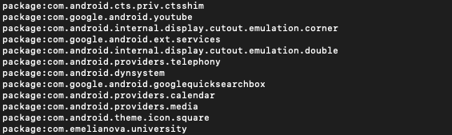
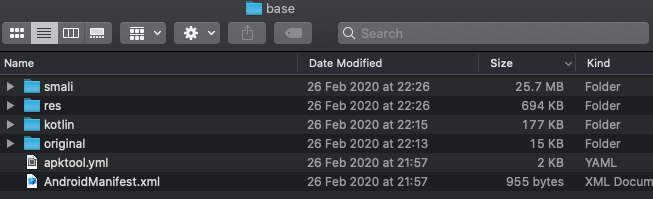

# Decoding APK files

1. Download APK from device via ADB:
  - ```adb shell pm list packages``` lists all packages.
  
  - We choose package we need and find path to it: ```adb shell pm path com.emelianova.numberofapps```
  
  - Finally, we can pull from that location: ```adb pull /data/app/com.emelianova.numberofapps-A-DSiI6WhfTksJ9ZjaNLlw==/base.apk ~/Desktop```
2. We decode APK using apktool: ```apktool d base.apk```
3. Result


